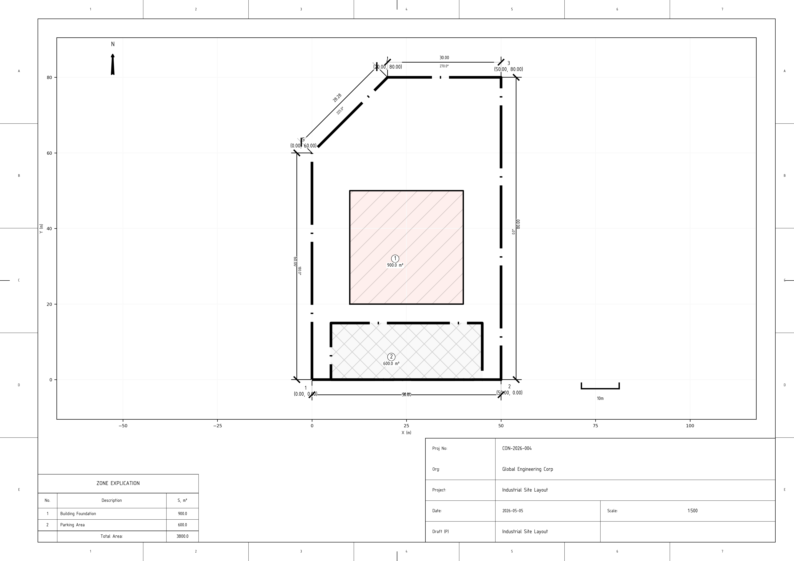

# 📐 Theodolite Survey MCP Server

A professional-grade MCP server for processing theodolite survey field books, traverse adjustments, and **ISO-compliant** technical drawing generation.


*Example: ISO-compliant plot plan generated automatically from survey data.*

## 🌟 Core Features

- **Precision Surveying:** Automated angular and linear misclosure adjustment using the Compass Rule.
- **ISO Standard Rendering:** Generates professional technical drawings (PNG/PDF) following strict international standards:
    - **ISO 5457:** Standard paper formats (A0-A4) with precise 20mm/10mm margins.
    - **ISO 7200:** Non-proportional title blocks (stamps) with absolute dimensions.
    - **ISO 3098:** Technical lettering using the specialized `osifont`.
    - **ISO 5455:** Strict engineering scales (1:50, 1:100, 1:500, etc.).
    - **ISO 129-1:** Smart dimensioning with automatic leaders for tight spaces.
- **Geodesic Logic:** Area calculation (Gauss formula), Azimuth calculations, and DMS/Decimal conversions.
- **Validation:** Automatic precision checks against industrial standards (1:2000, 1:5000).

## 🚀 Quick Start

### 1. Installation
Ensure you have Python 3.10+ installed.

```bash
# Clone the repository
git clone https://github.com/your-repo/theodolite-mcp.git
cd theodolite-mcp

# Install dependencies
pip install .
```

### 2. Run Demos
Experience the full pipeline from raw measurements to a finished technical drawing:

```bash
# Generate a professional construction site plan
PYTHONPATH=src python3 demo_construction.py

# Run a full traverse adjustment task
PYTHONPATH=src python3 demo_task.py
```

## 🛠 Available Tools

### 🖋 Rendering & Visualization
- **`draw_plot_plan`**: The flagship tool. Generates an ISO-compliant technical drawing (PNG) from survey data. Supports standard formats (A0-A4), **13 languages** (EN, RU, UK, DE, FR, ES, IT, PT, PL, TR, ZH, JA, KO), and professional styles (Construction/Shipbuilding).

### 📐 Survey Computation (Traverse)
- **`adjust_traverse_network`**: Performs a full Bowditch (Compass Rule) adjustment. Calculates coordinates from angles and distances, handles angular/linear misclosure, and generates a detailed Markdown report. Supports sea-level and grid scale corrections.
- **`reduce_stadia_readings`**: Tacheometric reduction. Computes horizontal distance and vertical elevation from top/bottom hair readings and vertical angles.
- **`compute_parcel_area`**: Calculates the precise area of a land plot or zone using the Gauss polygon formula.

### 🧭 Geodesic Utilities
- **`compute_inverse_geodetic_problem`**: Calculates the distance and azimuth between two known points (Inverse problem).
- **`compute_forward_azimuth`**: Calculates the bearing from one point to another.
- **`compute_back_azimuth`**: Calculates the reverse bearing (Back azimuth).
- **`compute_edm_atmospheric_correction`**: Calculates PPM correction for Electronic Distance Measurement (EDM) based on temperature and pressure.

### 🔢 Conversions
- **`dms_to_decimal_degrees`**: Converts traditional survey measurements (Degrees, Minutes, Seconds) to decimal format.
- **`decimal_degrees_to_dms`**: Converts decimal degrees back to a precise DMS structure.

## 📐 Industrial Compliance

This server is designed for professionals. Unlike generic plotting libraries, our rendering engine ensures that every line weight, font height, and margin meets **ISO Technical Documentation** requirements, making outputs suitable for official site plans and engineering reports.

## 📄 License
This project is licensed under the MIT License - see the LICENSE file for details. Technical font `osifont` is licensed under GNU LGPL.
