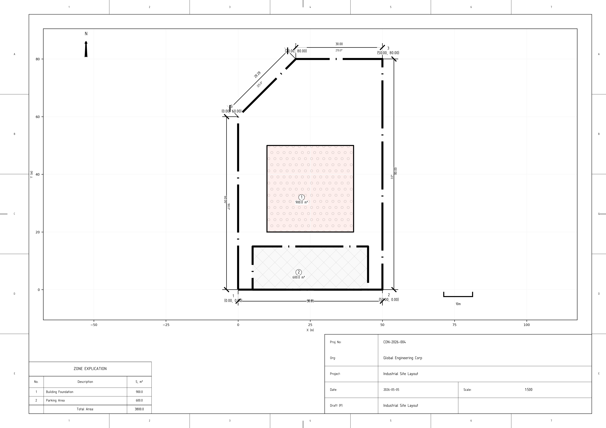
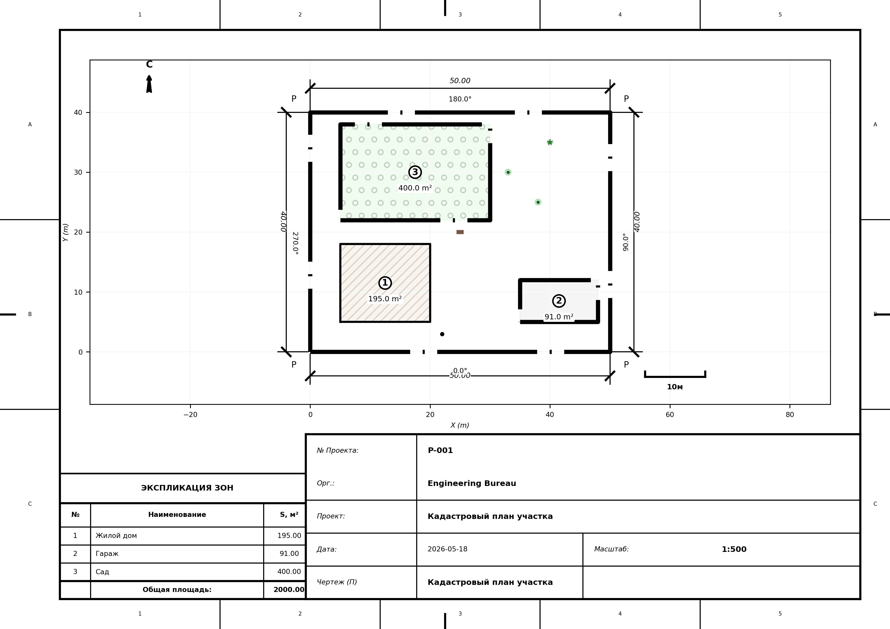
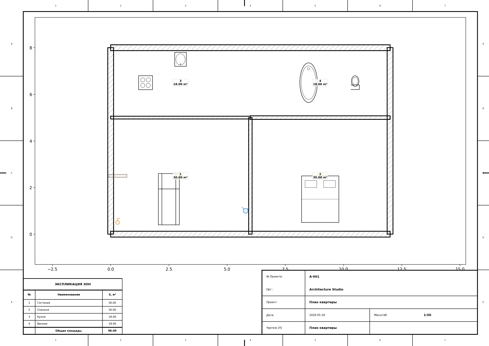
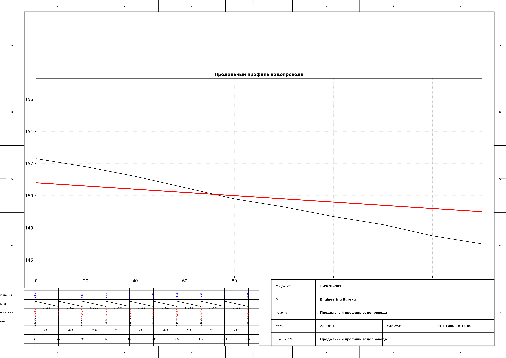
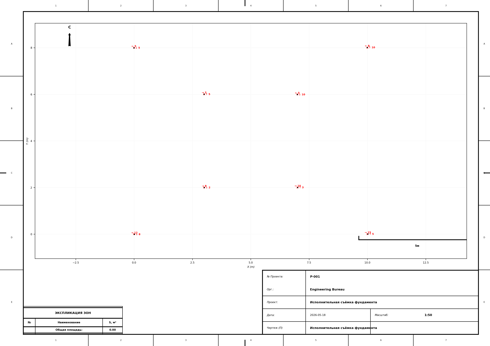

# 📐 Theodolite Survey MCP Server (Virtuoso Edition)

A professional-grade MCP server for engineering, surveying, and architectural automation. From raw field measurements to high-precision CAD interoperability and ISO-compliant technical drawings.


*Example: ISO-compliant plot plan with standardized material hatching and reference grids.*

---

## 📸 Output Examples

<table>
  <tr>
    <td align="center"><b>Cadastral Plan</b></td>
    <td align="center"><b>Interior Floor Plan</b></td>
  </tr>
  <tr>
    <td></td>
    <td></td>
  </tr>
  <tr>
    <td align="center"><b>Longitudinal Profile</b></td>
    <td align="center"><b>As-Built Report</b></td>
  </tr>
  <tr>
    <td></td>
    <td></td>
  </tr>
</table>

---

## 🌟 Core Capabilities

- **Expert P&ID Schematics:** ISO 6412/14617 compliant pipeline diagrams with smart collision detection and expert-grade auto-scaling.
- **Precision Surveying:** Automated Bowditch (Compass Rule) and **Least Squares Adjustment (LSA)** for surveying networks.
- **Infrastructure Engineering:** Longitudinal profiles for pipelines and roads with vertical exaggeration and auto-calculated slope tables ("podvals").
- **Architectural Design:** Professional floor plans with thick walls, material hatching (ISO 128-50), and dynamic furniture/sanitary blocks.
- **Construction Management:** As-built survey reports with deviation vectors (plan/fact) and earthwork volume cartograms.
- **Scientific Geodesy:** Support for ellipsoids (WGS84, Krasovsky), Gauss-Krüger/UTM projections, and 7-parameter Helmert transformations.
- **Global Compliance:** Full support for **Ukrainian (UK)**, **Russian (RU)**, and **English (EN)** with strict adherence to **ISO 5457, 7200, 3098, 129-1, and 128-50**.

---

## 📂 Project Structure

- `src/theodolite_mcp/` - Core application logic (LSA engine, Geodetic math, Rendering).
- `examples/water_supply/` - Expert scripts for water systems (Budget 7k, Ideal 10k, Winterized, Premium).
- `examples/` - Demonstration scripts for all major architectural and surveying use cases.
- `docs/gallery/` - Visual examples of generated ISO-compliant plans.
- `tests/` - Robust unit test suite covering edge cases and pixel-perfect rendering.
- `output/` - Default directory for generated PNG, SVG, and DXF files.
- `screenshots/` - Example outputs for all 4 drawing types.

---

## 🛠 Available MCP Tools

### 🖋 Expert Engineering Rendering (PNG/SVG)
- **`draw_pipeline_schematic`**: Generates ISO 6412/14617 pipeline diagrams (P&ID). Features expert-grade label placement, text halos, and dynamic symbol legends.
- **`draw_interior_plan`**: Generates architectural floor plans with walls, openings, and furniture.
- **`draw_plot_plan`**: Generates ISO-compliant cadastral, topographic, and site plans.
- **`draw_longitudinal_profile`**: Generates engineering profiles with auto-calculated slope/depth tables.
- **`draw_construction_as_built_report`**: Generates deviation schemes and earthwork volume plans.

### 📂 CAD Interoperability (DXF)
- **`export_to_dxf`**: Exports any PlotPlan to a multi-layered AutoCAD-compatible file.
- **`export_profile_to_dxf`**: Exports engineering profiles to DXF with correct vertical exaggeration.
- **`mcp_export_schematic_to_dxf`**: Exports pipeline schematics to professional DXF with proper layers.

### 📐 Surveying & Mathematics (LSA)
- **`adjust_network_least_squares`**: Scientific 2D network adjustment using the Gauss-Markov model.
- **`adjust_traverse_network`**: Standard Bowditch adjustment for theodolite traverses.
- **`compute_parcel_area`**: Precise area calculation using the Gauss polygon formula.

### 🧭 Geodesy & Conversions
- **`transform_coordinate_system`**: 7-parameter Helmert transformation (WGS84 ↔ Local).
- **`convert_sk42_to_wgs84`**: Soviet SK-42 (Pulkovo 1942) to WGS84 conversion.
- **`mgrs_to_latlon_conversion`**: Military Grid Reference System (MGRS) decoding.
- **`project_coordinates_gauss_kruger`**: Projects geodetic coordinates to flat X, Y grid.
- **`compute_inverse_geodetic_problem`**: Calculates distance/azimuth between points.
- **`dms_to_decimal_degrees`** / **`decimal_degrees_to_dms`**: Angle format conversions.

---

## 🚀 Quick Start

Ensure you have [uv](https://github.com/astral-sh/uv) installed.

```bash
# Generate the "Expert" Water Supply Schematic
uv run examples/water_supply/project_water_expert.py

# Generate the "Ideal 10k" Winterized House Setup
uv run examples/water_supply/project_water_ideal_10k.py

# Run standard architectural demo
uv run examples/demo_interior_full.py
```

## 📐 Industrial Compliance

This server is built for engineers. Every line weight, symbol geometry, and margin meets **ISO Technical Documentation** requirements. The rendering engine includes **advanced collision detection** to prevent text overlaps on dense schematics, and **white halo effects** for maximum readability on complex backgrounds.

## 📄 License
MIT License. Technical font `osifont` is licensed under GNU LGPL.
